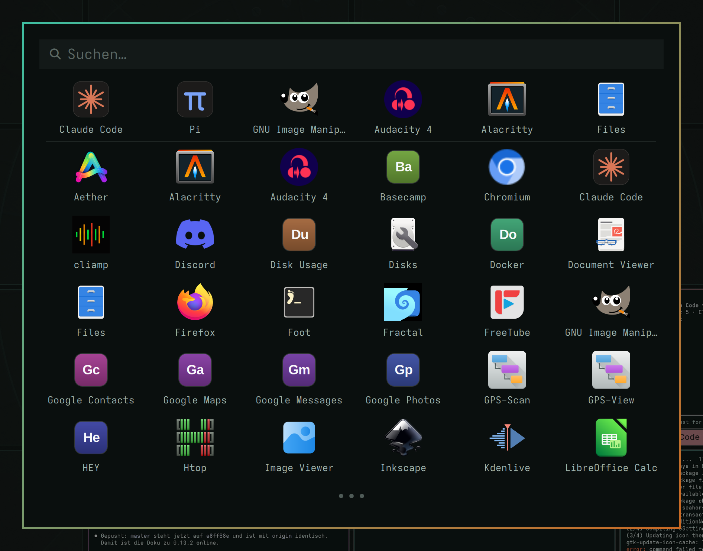

[Deutsch](README.md) · **English**

# Radial Mesh Launchpad

An app launchpad in the Omarchy 4 style with **filtering by window type** —
as an overlay plugin for the [Omarchy](https://omarchy.org) shell. Built for
the radial-mesh mode of
[hypr-radial-mesh](https://github.com/KGasteier/hypr-radial-mesh); branch `radialmesh` of
[omarchy-launchpad](https://github.com/KGasteier/omarchy-launchpad).



The plugin runs inside the shell process itself (Quickshell/QML) — no extra
program, no window rules, no theme templates. Colors, fonts, radii and
borders come from the menu tokens of the active theme.

## Features

- **Type filter bar** below the search: All · Terminals · TUIs · Agents ·
  GUIs · Webviews · Files. Each button shows how many programs it holds;
  buttons with no programs are hidden
- **Multiple assignments**: a program can belong to several types and shows
  up in all of them — Pi is an agent *and* a TUI, w3m is a TUI *and* a
  webview, Nautilus is files *and* GUI. The tint follows the type the mesh
  assigns
- **Alphabetical** within each type; search stays relevance-ordered
- **Type colour behind every icon**: each tile sits on a clearly visible
  tinted square in its type colour — no separate outline, slightly stronger
  under the cursor — including the MRU row
- **“Recently used" row** between the search field and the filter bar; it
  does not scroll and launches the app directly on click
- **6 × 6 grid**, scrolls when there are more programs; **dots at the
  bottom** while more programs lie below
- **Search** like the Omarchy menu, with a Nerd Font magnifier; the field
  reads “Search in TUIs…" while a type is selected
- **Esc steps back**: first the search text, then the type, then close
- **Tab / Shift+Tab** jumps to the next / previous type
- **Monogram tiles** for programs without an icon (`Monogram.js`)
- **Theme dependent**, no configuration of its own

## Installation

```bash
git clone -b radialmesh https://github.com/KGasteier/omarchy-launchpad.git radialmesh-launchpad
cd radialmesh-launchpad
./install.sh
```

`SUPER + R` then opens the grid. The installer restarts the shell once
(`omarchy restart shell`), which takes a few seconds — but not while the
screen is locked (that would orphan the lock); run `omarchy restart shell`
after unlocking. If `SUPER + R` is already bound elsewhere, the script warns.

It is also installed by
[hypr-radial-mesh](https://github.com/udk-gwk/hypr-radial-mesh).

**Replacing `omarchy-launchpad`**: run `./install.sh --uninstall` there
first, then install this one. Hyprland must not see two `SUPER + R`
bindings. The rofi-based version is unaffected.

Side-by-side installs still work — but then change the binding in
`~/.config/hypr/radialmesh-launchpad.lua` (e. g. to `SUPER + SHIFT + R`);
the plugin ID and the MRU file are separate either way.

To remove:

```bash
./install.sh --uninstall
```

This removes only its own artifacts (plugin folder, binding file, the
`require("hypr.radialmesh-launchpad")` block between markers in
`hyprland.lua`, the `shell.json` entry, the MRU state). Before every edit of
`hyprland.lua` a backup `hyprland.lua.bak.rmlaunchpad.<time>` is written; the five newest are kept.

## What lands where

| Path | Purpose |
|---|---|
| `~/.config/omarchy/plugins/community.radialmesh-launchpad/` | the plugin (copy of `plugin/`) |
| `~/.config/hypr/radialmesh-launchpad.lua` | key binding |
| `~/.config/hypr/hyprland.lua` | a `require("hypr.radialmesh-launchpad")` block between markers |
| `~/.config/omarchy/shell.json` | entry under `plugins` (managed by the shell) |
| `~/.local/state/radialmesh-launchpad/recent.json` | recently launched apps (seeded from the original's MRU on first run) |

## Types

Each program is classified from its desktop file fields: `Exec` (terminal
starters, `--app-id=TUI.agent`, `omarchy-launch-webapp`), `Terminal=true`
and `Categories`. The types and their colours are identical to
`M.config.colors` in `hypr-radial-mesh` — a program carries the same colour
in the launchpad as its card later has in the mesh.

| Type | Colour | detected via |
|---|---|---|
| Terminals | turquoise | category `TerminalEmulator` |
| TUIs | green | `Terminal=true`, `xdg-terminal-exec`, `ConsoleOnly` |
| Agents | magenta | `--app-id=TUI.agent`, `org.omarchy.agent` (also a TUI) |
| Webviews | orange | category `WebBrowser`, `omarchy-launch-webapp` |
| Files | sand | category `FileManager` / `FileSystem` |
| GUIs | rose | anything with its own window that is not terminal/TUI/webview |

Editors, viewers and system tiles keep their own colour type (blue, violet,
grey) but stay reachable through the buttons above — they are GUIs as well.
Hand assignments live in `plugin/Types.js` (`OVERRIDES`, keyed by desktop ID).

## Invocation and customization

By hand or from scripts, optionally with a preselected type:

```bash
omarchy-shell shell toggle community.radialmesh-launchpad
omarchy-shell shell toggle community.radialmesh-launchpad '{"type":"tui"}'
omarchy-shell shell toggle community.radialmesh-launchpad '{"type":"ai"}'
```

Every mesh category is accepted: `terminal`, `tui`, `ai`, `gui`, `webview`,
`files`, `editor`, `viewer`, `config`. The last three normally have no button
of their own. When preselected, their button is appended to the bar until the
launchpad closes. An unknown type opens "All".

The companion `radialmesh-companion` of
[hypr-radial-mesh](https://github.com/udk-gwk/hypr-radial-mesh) opens the
launchpad when the "+" of an empty cell is clicked, filtered to the category
of the neighbouring card (for all categories since hypr-radial-mesh 0.26.1).

### Size and grid

The default is a 6 × 6 grid at a bit over 60 % of the screen width. Adjust
it in the plugin's own entry in `~/.config/omarchy/shell.json`, e. g. for
smaller screens:

```json
"plugins": [
  { "id": "community.radialmesh-launchpad", "columns": 5, "rows": 5, "iconSize": 30, "width": 0.42 }
]
```

| Key | Default | Range | Meaning |
|---|---|---|---|
| `columns` | 6 | 3–10 | columns (also the length of the MRU row) |
| `rows` | 6 | 2–10 | visible rows, more by scrolling |
| `iconSize` | 38 | 20–96 | icon size in logical pixels; row height and type tile follow |
| `width` | 0.615 | 0.3–1 | card width as a fraction of the screen width |

The shell watches `shell.json`; new values apply the next time the
launchpad opens, no restart needed.

**Small resolutions adapt on their own:** the card opens on the focused
monitor and always stays fully on screen. If the height is short it shows
fewer rows (never a cut-off one), if the width is short, fewer columns. If
the type buttons don't fit on one line, counts and colour dots are dropped
and the buttons stay tinted. A 900 × 565 logical-pixel screen still shows
6 × 2.

The shortcut lives in `~/.config/hypr/radialmesh-launchpad.lua`.
`./install.sh --no-bind` installs without a key binding.

## Known quirks

- **Hot reload does not work for this overlay.** The shell notices changes
  in the plugin folder (inotify), but the loaded overlay instance stays as
  it is. After changes: `omarchy restart shell`.
- **Symlinks instead of a copy** in the plugin folder are not seen by the
  watcher — `install.sh` copies for that reason.
- The magnifier in the search field is a Nerd Font glyph (`U+F002`); without
  a Nerd Font a placeholder box appears (`ttf-jetbrains-mono-nerd` helps).
- Search shows only the hits, no MRU row — like the original.
- Editors, viewers and system tiles have **no buttons of their own** (they
  would duplicate `GUIs`); their tint still tells them apart.

## License

MIT, see [LICENSE](LICENSE).
